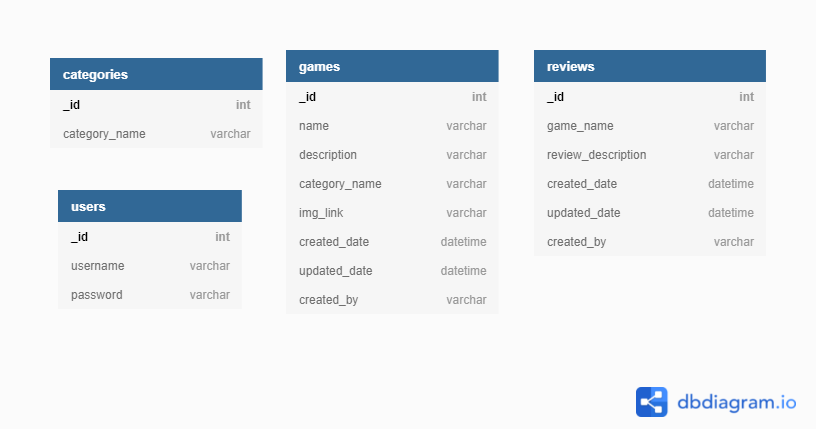

<h1 align="center">Game Reviews</h1> 
The scope for this project is to create a user centric website using Flask, Python, MongoDB and Heroku.
  
Game Reviews is a website that allows users to search for Games that they would like to play and see what the community has to say. You can join the community and add to the growing selecting of games and review.
  

# Table of contents
- [UX](#user-experience)
    - [User stories](#user-stories)
    - [Design](#design)
    - [Surface Plane](#surface-plane)
    - [Wireframes](#wireframes)
- [Technologies Used](#technologies-used)
    - [Languages and Frameworks](#languages-and-frameworks)
- [Database Schema](#database-schema)
- [Database and Schema](#database-and-schema)
    - [MongoDB Setup](#mongodb-setup)
- [Deployment](#deployment)
    - [Forking the GitHub Repository](#forking-the-github-repository)
    - [Making a Local Clone](#making-a-local-clone)
    - [Heroku Deployment](#heroku-deployment)
- [Credits](#credits)
- [Content](#content)
- [Acknowledgements](#acknowledgements)

# User Experience
## User stories
 -   ### First Time Visitor Goals
        1. As a First Time Visitor, I want to easily understand the main purpose of the site.
        2. As a First Time Visitor, I want to be able to easily navigate throughout the site and to contact the developer for more information.
        3. As a First Time Visitor, I want to easily be able to sign-up
        4. As a First Time Visitor, I want to be able to search for games
 -   ### Returning or Frequent Visitor Goals
        1. As a Returning Visitor, I want to be able to log in.
        2. As a Returning Visitor, I want to be able to log out.
        3. As a Returning Visitor, I want to be able add a game.
        4. As a Returning Visitor, I want to be able edit a game I have added.
        5. As a Returning Visitor, I want to be able delete a game I have added.
        6. As a Returning Visitor, I want to be able add a review.
        7. As a Returning Visitor, I want to be able edit a review I have added.
        8. As a Returning Visitor, I want to be able delete a review I have added.
        9. As a Returning Visitor, I want to be able to delete my account.

## Design
### Strategy Plane
Game Reviews aims to provide users with a website that will provide user reviews for Games.

The objective of this project is to give the user the ability to navigate the site, log in and sign out as well as provide logged in users with the ability to add, edit or remove games and reviews they have added to the platform.

### Scope Plane
This project will look to provide an interactive website.

The website will convey the developers use of Python, HTML, CSS, jQuery and Flask to build a user centric website.

### Structure Plane
As the aim of the site is to provide an interactive website to the users. The site was developed to be a multi-page site. The User has access to navigation in the top right of the page.

The user has the ability to navigation to the Home page, their profile page and login or out from the top right of the page and from the slide out menu on Mobile.

### Skeleton Plane
From the structure above I was able to generate the below Wireframes for the site, while these wireframes are guidelines for building the main structure of the site the layout of the content is subject to change.

### Surface Plane
  -   #### Colour Scheme
        The colour scheme I chose for the site was based around Retro neon with Black and White displays.
        - Black: (Hex) #211a1dff
        - White: white or (Hex)#fff
        - Orange: (Hex)#FF570A

 -   #### Typography
       I deicided on using Google Fonts Orbitron and Roboto throughout the site to have a Retro type font face.

-   #### Imagery
    I used a Retro background from the [80s-retro-games](https://wallpaperaccess.com/80s-retro-games) using this image [View](https://github.com/KevAndrews/Milestone_Project_3/blob/main/static/images/bg_img.jpg)

## Wireframes
-   #### Balsamiq - [View](https://github.com/KevAndrews/Milestone_Project_3/blob/main/wireframes/MS3_Wireframes.bmpr)

-   #### Desktop
    1.  Home Page Wireframe - [View](https://github.com/KevAndrews/Milestone_Project_3/blob/main/wireframes/desktop/Home%20Page%20Desktop%20View.png)
    2.  Add Game Page Wireframe - [View](https://github.com/KevAndrews/Milestone_Project_3/blob/main/wireframes/desktop/Add%20Game%20Page%20Desktop%20View.png)
    3.  Add Review Page Wireframe - [View](https://github.com/KevAndrews/Milestone_Project_3/blob/main/wireframes/desktop/Add%20Review%20Page%20Desktop%20View.png)
    4.  Edit Game Page Wireframe - [View](https://github.com/KevAndrews/Milestone_Project_3/blob/main/wireframes/desktop/Edit%20Game%20Page%20Desktop%20View.png)
    5.  Edit Review Page Wireframe - [View](https://github.com/KevAndrews/Milestone_Project_3/blob/main/wireframes/desktop/Edit%20Review%20Page%20Desktop%20View.png)
    6.  Login Page Wireframe - [View](https://github.com/KevAndrews/Milestone_Project_3/blob/main/wireframes/desktop/Login%20Page%20Desktop%20View.png)
    7.  Profile Page Wireframe - [View](https://github.com/KevAndrews/Milestone_Project_3/blob/main/wireframes/desktop/Profile%20Page%20Desktop%20View.png)
    8.  Signup Page Wireframe - [View](https://github.com/KevAndrews/Milestone_Project_3/blob/main/wireframes/desktop/Signup%20Page%20Desktop%20View.png)

-   #### Tablet
    1.  Home Page Wireframe - [View](https://github.com/KevAndrews/Milestone_Project_3/blob/main/wireframes/tablet/Home%20Page%20Tablet%20View.png)
    2.  Add Game Page Wireframe - [View](https://github.com/KevAndrews/Milestone_Project_3/blob/main/wireframes/tablet/Add%20Game%20Page%20Tablet%20View.png)
    3.  Add Review Page Wireframe - [View](https://github.com/KevAndrews/Milestone_Project_3/blob/main/wireframes/tablet/Add%20Review%20Page%20Tablet%20View.png)
    4.  Edit Game Page Wireframe - [View](https://github.com/KevAndrews/Milestone_Project_3/blob/main/wireframes/tablet/Edit%20Game%20Page%20Tablet%20View.png)
    5.  Edit Review Page Wireframe - [View](https://github.com/KevAndrews/Milestone_Project_3/blob/main/wireframes/tablet/Edit%20Review%20Page%20Tablet%20View.png)
    6.  Login Page Wireframe - [View](https://github.com/KevAndrews/Milestone_Project_3/blob/main/wireframes/tablet/Login%20Page%20Tablet%20View.png)
    7.  Profile Page Wireframe - [View](https://github.com/KevAndrews/Milestone_Project_3/blob/main/wireframes/tablet/Profile%20Page%20Tablet%20View.png)
    8.  Signup Page Wireframe - [View](https://github.com/KevAndrews/Milestone_Project_3/blob/main/wireframes/tablet/Signup%20Page%20Tablet%20View.png)

-   #### Mobile
    1.  Home Page Wireframe - [View](https://github.com/KevAndrews/Milestone_Project_3/blob/main/wireframes/mobile/Home%20Page%20Mobile%20View.png)
    2.  Add Game Page Wireframe - [View](https://github.com/KevAndrews/Milestone_Project_3/blob/main/wireframes/mobile/Add%20Game%20Page%20Mobile%20View.png)
    3.  Add Review Page Wireframe - [View](https://github.com/KevAndrews/Milestone_Project_3/blob/main/wireframes/mobile/Add%20Review%20Page%20Mobile%20View.png)
    4.  Edit Game Page Wireframe - [View](https://github.com/KevAndrews/Milestone_Project_3/blob/main/wireframes/mobile/Edit%20Game%20Page%20Mobile%20View.png)
    5.  Edit Review Page Wireframe - [View](https://github.com/KevAndrews/Milestone_Project_3/blob/main/wireframes/mobile/Edit%20Review%20Page%20Mobile%20View.png)
    6.  Login Page Wireframe - [View](https://github.com/KevAndrews/Milestone_Project_3/blob/main/wireframes/mobile/Login%20Page%20Mobile%20View.png)
    7.  Profile Page Wireframe - [View](https://github.com/KevAndrews/Milestone_Project_3/blob/main/wireframes/mobile/Profile%20Page%20Mobile%20View.png)
    8.  Signup Page Wireframe - [View](https://github.com/KevAndrews/Milestone_Project_3/blob/main/wireframes/mobile/Signup%20Page%20Mobile%20View.png)

# Technologies Used
## Languages and Frameworks
- [Python](https://www.python.org/)
- [JavaScript](https://en.wikipedia.org/wiki/JavaScript)
- [HTML](https://en.wikipedia.org/wiki/Hypertext_Markup_Language)
- [CSS](https://en.wikipedia.org/wiki/Cascading_Style_Sheets)
- [Materializecss](https://materializecss.com/)
- [Fontawesome](https://fontawesome.com/)
- [Google Fonts](https://fonts.google.com/)
- [Flask](https://en.wikipedia.org/wiki/Flask_(web_framework))
- [JQuery](https://jquery.com/)

# Database and Schema
## MongoDB Setup
1. Sign up for a free account and login to [MongoDB](https://www.mongodb.com).
2. (If you are new at MongoDB) create a cluster first by clicking "Create" and following the steps.
3. Go to your cluster and click on the button "Connect".
4. Select "Connect to your application".
5. Select Python as "Driver" and choose "Version 3.6 or later"
6. Use the below collection schema

# Deployment
## Forking the GitHub Repository
The GitHub Repository can be forked to make a copy of the original repository on the GitHub account to view and/or make changes without affecting the original repository in the following way.

1.	By logging in to GitHub and locating the [GitHub Repository](https://github.com/KevAndrews/Milestone_Project_3).
2.	Selecting the "Fork" button at the top of the Repository (it is located at the top right of the page under the profile image).
3.	There should then be a copy of the original repository in your GitHub account.

## Making a Local Clone
The GitHub Repository can be cloned in the following way:

1.	By logging in to GitHub and locating the [GitHub Repository](https://github.com/KevAndrews/Milestone_Project_3).
2.	Under the repository name, clicking the dropdown button marked “Code” and then selecting "Clone or download".
3.	Copying the link under "Clone with HTTPS", to clone the repository using HTTPS.
4.	Opening Git Bash.
5.	Changing the current working directory to the location where you want the cloned directory to be made.
6.	Typing git clone, and pasting the URL copied in Step 3.
7.	Pressing Enter to create the local clone.

## Heroku Deployment
1. For Heroku first create a requirements.txt file by running the following command in the CLI:
    - **pip3 freeze --local > requirements.txt**
2. Create a Procfile file with this command:
    - **echo web: python app.py > Procfile**
3. Sign up and log in to [Heroku](https://www.heroku.com/).
4. Create a new app by clicking on the button "New".
5. Give your app a name, select your region and click "Create app".
6. Navigate to the "Deploy" tab and select "Github" as a deployment method.
7. Search for your repository name and connect.
8. Now open the "Settings" tab and click on "Reveal Config Vars".
9. Add your configuration variables:
    - **IP** : `0.0.0.0`
    - **PORT** : `5000`
    - **SECRET_KEY** : `<secret_key>`
    - **MONGO_URI** : `<mongodb_URI>`
    - **MONGO_DBNAME** : `<db_name>`
10. Navigate to the Tab "Deploy" and enable "Automatic Deploys".

# Credits

1.	https://www.favicon.cc/?action=icon&file_id=520466
2.	https://wallpaperaccess.com/80s-retro-games

# Content
The audio and images belong to documented third parties noted in Credits section above, all other content was written by the developer.

# Acknowledgements
I would like to thank the team at the Code Institute for all the courses they provided that help me gain the knowledge I needed to build this game.
  
I would also like to thank my wife Áine for her support throughout its development.