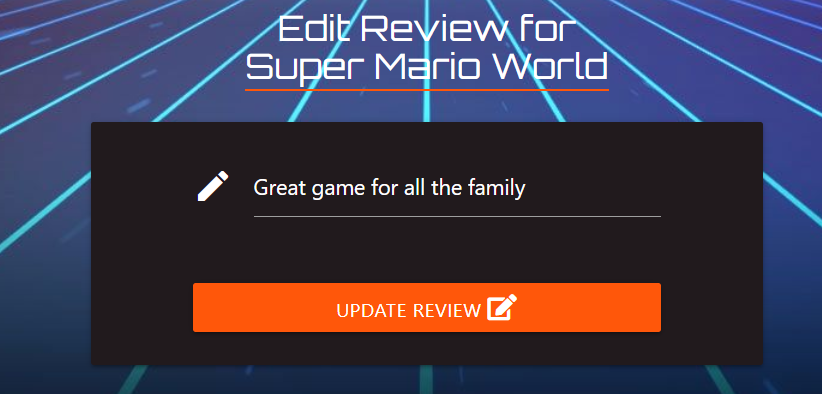

<h1 align="center">Testing</h1> 

## Code Validation
- #### HTML was validated using [validator.w3.org](https://validator.w3.org/). The validator gives a warning if you do not use h2-h6 in a section tag, the design of the site did not warrent the use of these tags so I have left these warning in the final version, the duplicate IDs are left in as they are used for the active links - The results can be found here: 
    1.  [add_game.html](readme_images/add_game_page.png) 
    2.  [add_review.html](readme_images/add_review_page.png)
    3.  [display_game.html](readme_images/display_game_page.png) 
    4.  [edit_game.html](readme_images/edit_game_page.png) 
    5.  [edit_review.html](readme_images/edit_review_page.png) 
    6.  [index.html](readme_images/index_page.png) 
    7.  [login.html](readme_images/login_page.png) 
    8.  [signup.html](readme_images/signup_page.png) 

- #### CSS was validated using [jigsaw.w3.org](https://jigsaw.w3.org/css-validator/) I did not have any errors in the validation - The results can be found [here](readme_images/css.png).

- #### Chromes Developer Tool Lighthouse, this tool highlighted that I was missing the Meta description tag and keywords from my site so I have updated the pages to contain this - The desktop audit results can be found here:
    1.  [add_game.html](PDF/add_game_page.pdf) 
    2.  [add_review.html](PDF/add_review_page.pdf)
    3.  [display_game.html](PDF/display_game_page.pdf) 
    4.  [edit_game.html](PDF/edit_game_page.pdf) 
    5.  [edit_review.html](PDF/edit_review_page.pdf) 
    6.  [index.html](PDF/index_page.pdf) 
    7.  [login.html](PDF/login_page.pdf) 
    8.  [signup.html](PDF/signup_page.pdf) 

- #### JS was validated using [jshint.com](https://jshint.com/) - The results can be found [here](readme_images/js.png).

- #### Manual Testing was completed using Chrome, Edge, Firefox and Safari. Testing included the testing of all navigation links and the responsiveness of the site across these browsers. 

## Testing the User Experience (UX) stories
 -   ### First Time Visitor Goals
       
       1. As a First Time Visitor, I want to easily understand the main purpose of the site.
        - From the image above you can see the mission of this website
       2. As a First Time Visitor, I want to be able to easily navigate throughout the site.
        - From the image above you can see the menu at the top right of the screen and you can select the images below to go to the game page.
       3. As a First Time Visitor, I want to easily be able to sign-up
        - From the image above you can see the call to action to sign up or you can use the menu on the top right.
 -   ### Returning or Frequent Visitor Goals
       1. As a Returning Visitor, I want to be able to log in.
       
       By filling in the form and selecting Log in button you can log in to the site.
       2. As a Returning Visitor, I want to be able to log out.
       
       By clicking on the logout button on the top right you can logout of the site
       3. As a Returning Visitor, I want to be able add a game.
       
       First select the 'My Games' tab and then the Add Game button
       
       By filling in the form and selecting Add Game button you can add a game to the site.
       4. As a Returning Visitor, I want to be able edit a game I have added.
       
       First select the 'My Games' tab and then the Edit button.
       
       By filling in the form and selecting Edit Game button you can edit a game to the site.
       5. As a Returning Visitor, I want to be able delete a game I have added.
       
       First select the 'My Games' tab and then the Delete button.
       6. As a Returning Visitor, I want to be able add a review.
       
       First select the 'My Reviews' tab and then the Add Review button
       
       By filling in the form and selecting Add Review button you can add a Review to the game.
       7. As a Returning Visitor, I want to be able edit a review I have added.
       
       First select the 'My Reviews' tab and then the Edit button.
       
       By filling in the form and selecting Edit Review button you can edit a Review on a game.
       8. As a Returning Visitor, I want to be able delete a review I have added.
       
       First select the 'My Reviews' tab and then the Delete button.

 -   ### Frequent Administrator Goals
       1. As a Frequent Administrator, I want to be able to see all reviews.
       
       First select the 'Reviews' tab and then you can scroll through the reviews.
       2. As a Frequent Administrator, I want to be able to see all games.
       
       First select the 'Games' tab and then you can scroll through the games.
       3. As a Frequent Administrator, I want to be able to see all users.
       
       First select the 'Users' tab and then you can scroll through the users.
       4. As a Frequent Administrator, I want to be able to edit all reviews.
       
       First select the 'Reviews' tab and then the Edit button and follow the same steps as normal.
       5. As a Frequent Administrator, I want to be able to edit all games.
       
       First select the 'Games' tab and then the Edit button and follow the same steps as normal.
       7. As a Frequent Administrator, I want to be able to delete all reviews.
       
       First select the 'Reviews' tab and then the Delete button and follow the same steps as normal.
       8. As a Frequent Administrator, I want to be able to delete all games.
       
       First select the 'Games' tab and then the Delete button and follow the same steps as normal.
       9. As a Frequent Administrator, I want to be able to delete all users.
       
       First select the 'Users' tab and then the Delete button and follow the same steps as normal.
       